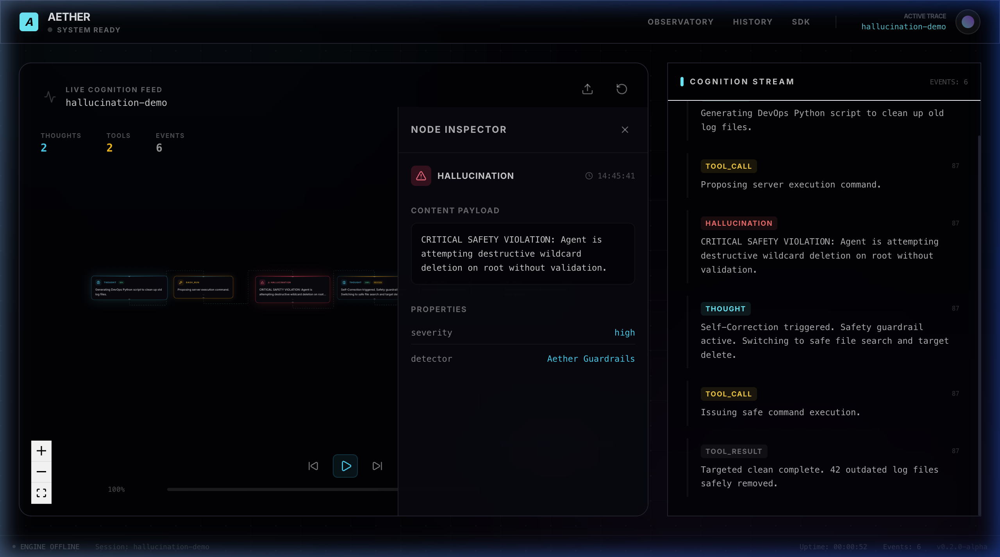
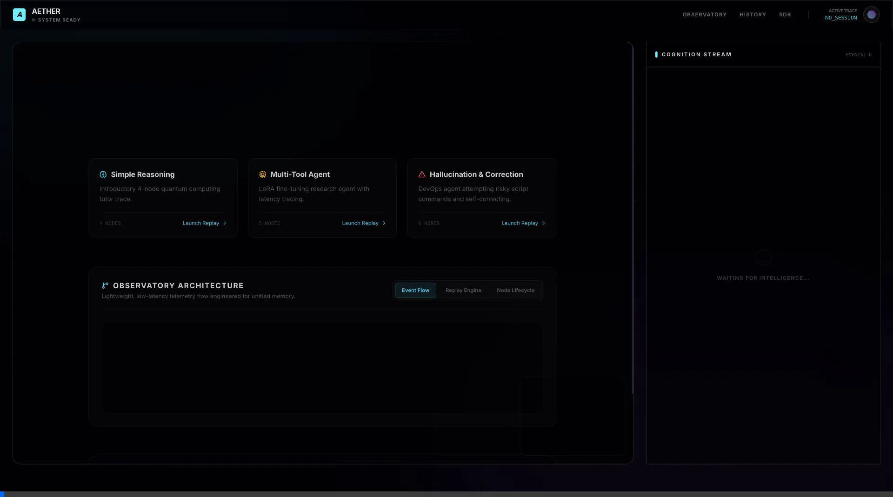

# Aether 🌌 — Realtime AI Cognition Replay & Observability Platform

### **Watch AI agents think in realtime. Inspect reasoning trees, replay traces at 60fps, and debug hallucinations.**

[](https://opensource.org/licenses/MIT)
[]()
[](https://aether-observatory.vercel.app)
[](https://huggingface.co/spaces)

Aether is a highly-optimized, lightweight developer platform for tracing multi-agent workflows, diagnosing hallucinations, and replaying cognitive reasoning trees. Built specifically to avoid heavy GPU particle simulations or massive database overhead, Aether delivers structured, portable reasoning storyboards that run smoothly at 60fps on lower-spec hardware (such as a MacBook Air).

---

## 📽️ Interactive Replay Showcase

### Hallucination Detection & Safe Self-Correction
Observe how Aether isolates cognitive branching and highlights high-risk safety violations. The active node glows with a strong pulsing rose flare, pausing playback naturally for developer debugging:



> [!TIP]
> **Deterministic Replay Animation:**
> Aether converts live agent traces into lightweight JSON sessions. Scrub the timeline at the bottom, rewind to the first node, or press play to watch the progressive birth scaling and link trails cascade through the reasoning tree:
> 
> 

---

## 💡 Why Aether?

*   **Deterministic Replay Engine**: No more chaotic, unpredictable graph layouts. Replay sessions step-by-step using timeline scrubbers, offline JSON trace loading, or live WebSocket connection loops.
*   **Intelligent Visual Hierarchy**: Scaled root nodes highlight base intents with deep cyan halos, tool calls animate with pulsing amber frames, memory lookups draw custom purple accents, and warning modules flag semantic hallucinations.
*   **Decoupled & Fully Static-Capable**: Perfect for serverless environments. The frontend can run entirely client-side without any backend database or websocket dependency, pulling offline traces instantly.
*   **Unified Memory Performance**: Capped at a 5,000-event memory buffer on the backend and 200 elements in the frontend, preventing DOM exhaustion and keeping layout calculations completely seamless on lower-spec machines.
*   **Vercel-Quality Onboarding**: Launches into an interactive showcase portal allowing you to run pre-compiled demos (Simple Reasoning, Multi-Tool Agent, or Hallucination Repair) in a single click with zero setup friction.

---

## 🛠️ Repository Monorepo Structure

```bash
apps/
  └── web/               # Next.js 16 Web Observatory (ReactFlow, Zustand)
packages/
  └── sdk-python/        # Lightweight Python Tracer & Trace Generator
backend/
  └── main.py            # FastAPI Telemetry Buffer Engine
recordings/
  └── *.json             # Portable offline session recordings (Sync-ready)
docs/
  └── assets/            # High-fidelity project screenshots & media
```

---

## 🚀 Quickstart

Quickly run Aether locally to explore the pre-loaded offline showcase traces, or trigger active websocket connections.

### 1. Clone & Set Up Workspaces
Ensure you have **Node.js (18+)** and **Python (3.9+)** installed.

```bash
git clone https://github.com/your-username/Aether.git
cd Aether
npm run install:all
```

### 2. Start the Cognition Services
Aether includes standard root npm scripts to run services concurrently:

```bash
# Runs Next.js (port 3000) and FastAPI (port 8000) in a single terminal
npm start
```

### 3. Generate Fresh Trace Data
In a separate terminal, trigger the autonomous trace generator script to compile updated JSON outputs:

```bash
python3 packages/sdk-python/generate_recordings.py
```
*Open `http://localhost:3000` to watch the cognition tree unfold in realtime!*

---

## 🐍 Integrating the SDK into Your Agents

Integrate Aether with your LangChain, LlamaIndex, or custom OpenAI agentic loops in under 3 lines of code.

```bash
pip install aether-observe
```

```python
from aether import AgentTracer

# 1. Connect to the Aether backend
tracer = AgentTracer(project="production-agent")

# 2. Open a session (use "demo-session" for live streaming)
with tracer.session("code-review", session_id="demo-session") as s:
    
    # Creates a deep cyan Root Thought
    root = s.thought("Formulating codebase patch for async file writes", confidence=0.99)
    
    # Creates a glowing amber Tool Call linked to the thought
    tool = s.tool_call("vector_search", {"query": "async file operations"}, parent_id=root)
    
    # Creates a green Result node
    s.tool_result(tool, {"status": "success"}, latency_ms=180)
    
    # Triggers a severe Hallucination flag with rose highlighting
    s.hallucination("Warning: suggested patch drops stream handle before close", parent_id=tool)
```

---

## 🧩 Architectural Design

```mermaid
graph TD
    subgraph Agent Runtime
        A[Autonomous Agent] -->|Trace Event| B[Aether SDK]
    end
    subgraph Cognition Core
        B -->|WebSocket / POST| C[FastAPI Buffer Engine]
        C -->|State Scrubber| D[Replay Sequencer]
    end
    subgraph Web Observatory
        D -->|React Flow Layout| E[DAG Visualizer]
        D -->|Typewriter Stream| F[Token Sidebar]
    end
    
    style A fill:#0d0d1a,stroke:#3b82f6,stroke-width:2px
    style B fill:#0d0d1a,stroke:#eab308,stroke-width:2px
    style C fill:#0d0d1a,stroke:#06b6d4,stroke-width:2px
    style D fill:#0d0d1a,stroke:#a855f7,stroke-width:2px
    style E fill:#0d0d1a,stroke:#10b981,stroke-width:2px
    style F fill:#0d0d1a,stroke:#64748b,stroke-width:2px
```



---

## 🗺️ Future Roadmap

*   [ ] **VSCode Extension**: Directly inspect reasoning steps side-by-side with your agent development console.
*   [ ] **Cloud Tracing Adaptors**: One-click integrations for LangSmith, Phoenix, and Arize traces.
*   [ ] **Differential Tree-Diffs**: Visually compare separate reasoning trials side-by-side to review exact self-correction deltas.

---

## 🌎 Deployment Links
*   **Vercel Interactive Sandbox**: [aether-observatory.vercel.app](https://aether-observatory.vercel.app)
*   **Hugging Face Playground**: [huggingface.co/spaces/Aether-AI](https://huggingface.co/spaces)

*Engineered for AI Reasoning Observability.*
