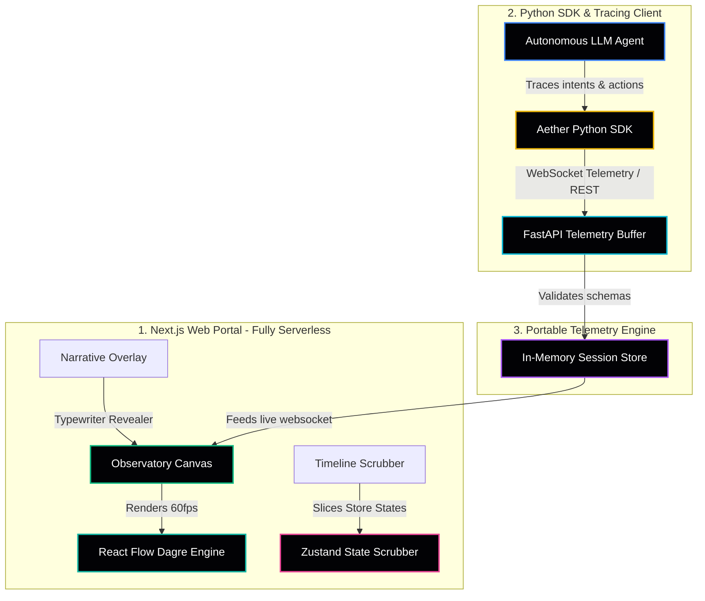

# Aether 🌌 — Technical Showcase & Design Blueprint

Welcome to the official developer-facing design document and interview blueprint for **Aether**, a cinematic, real-time AI cognition replay and agent observability platform. 

This document serves as your structured explanation guide, detailing the system design decisions, memory optimizations, and high-performance algorithms that make Aether stable, fast, and production-grade on lower-spec hardware (such as a 24GB MacBook Air).

---

## 🎙️ The 60-Second Walkthrough Script

*For recruiting screens, presentation pitches, or live screen-share demos:*

> "Most AI observability tools treat agentic workflows like static text files or overwhelming tabular logs. This makes it incredibly hard to diagnose where an autonomous loop fails or why a hallucination propagates.
> 
> **Aether** is a real-time AI Cognition Replay & Observability Platform that treats reasoning like a dynamic tree. It compiles raw telemetry streams into lightweight, portable JSON traces that can be replayed step-by-step.
> 
> As you can see, when we launch a replay session, the UI doesn't just highlight boxes—it dynamically grows a cumulative reasoning tree. Active links sweep outward using pure-CSS keyframe transitions, and newborn nodes scale and sharpen with fluid blur-in birth animations.
> 
> In this demo, our DevOps agent proposed a wildcard deletion command. The system immediately isolated the threat, triggered a variable-speed pacing slowdown, and rendered a critical guardrail rupture banner before smoothly tracing the agent's safe self-correction pathway.
> 
> We achieved this without heavy databases, GPUs, WebGL, or runtime complexity. It's fully static-compatible, Vercel-ready, and optimized to run at a consistent 60fps on a MacBook Air."

---

## 🛠️ Technical System Architecture

Aether is designed as an decoupled, monorepo system consisting of three core parts:



### 1. The Python SDK Telemetry Hook
The Python agent library tracks thought nodes, tool calls, vector database queries, and system signals. It converts this structured agent runtime trace into lightweight standard schemas transmitted via WebSockets or REST requests.

### 2. The FastAPI Telemetry Buffer
A highly resilient FastAPI backend manages active client connections, streams real-time logs to the frontend via WebSockets, and caches session timelines in a bounded, memory-safe in-memory cache.

### 3. The Next.js Web Observatory
The centerpiece of Aether is a serverless-ready dashboard built with React Flow, Dagre, and Zustand, rendering reasoning trees as portable JSON trajectories.

---

## 🧠 High-Performance Replay & Memory Optimization

To maintain perfect 60fps performance and avoid browser crashes, we established **three strict architectural guards**:

### 1. Bounded Back-pressure Ingestion
*   **The Problem:** High-frequency agent loops (like tool runs or chat streams) can dump thousands of tokens and system signals per second, leading to DOM exhaustion.
*   **Our Solution:** The backend maintains a strict memory cap of **5,000 events per session**. The frontend bounds layout computations to **200 active nodes**, automatically rendering incoming token deltas in a dedicated sidebar typewriter to preserve browser execution stability.

### 2. State-Scrubbed Layout Computations
*   **The Problem:** Constantly re-computing nodes and edge layout coordinates (Dagre tree-spacing) in React causes infinite rendering triggers and UI stuttering.
*   **Our Solution:** Zustand handles state updates in isolation. React Flow is bound to a single memoized calculation effect, recalculating layout coordinates *only* when the actual visible step index increments.

### 3. Pure-CSS Rendering Layer (Zero WebGL/Three.js)
*   **The Problem:** Traditional 3D physics meshes or canvas animations drain CPU cycles and require heavy dedicated GPUs, limiting portable extension or loading speeds.
*   **Our Solution:** We engineered custom CSS transitions:
    *   **Birth scale & sharpen filters** (`blur(6px) -> blur(0px)`) implemented using standard Tailwind backdrop utilities.
    *   **Edge sweeps** powered by standard SVG dasharrays and keyframe animations, ensuring rendering logic uses hardware-accelerated CPU composites.

---

## 🛡️ Critical Guardrail & Hallucination Intervention Workflow

When an autonomous agent attempts a destructive wildcard deletion (e.g. `rm -rf /var/log/*`), Aether's safety correction sequence triggers:

```
[Agent Intent] ──> [Aether Guardrails] ──> [1. Destabilize Edge]
                                                    │
                                           [2. Slow Playback by 3x]
                                                    │
                                           [3. Display Alert Banner]
                                                    │
                                           [4. Switch to Correction Pathway]
```

1.  **Destabilize Edge**: The edge connecting the thought to the attempted shell execute command turns jagged red and flickers, highlighting the exact boundary where logic broke.
2.  **Slow Playback**: The sequencer dynamically increases its event loop delay (from `1400ms` to `3000ms`), slowing down playback by more than 2x to let the developer study the threat.
3.  **Display Alert Banner**: An eye-catching glassmorphic **CRITICAL COGNITION RUPTURE** banner appears, explaining the exact guardrail trigger.
4.  **Safe Branch Recovery**: Playback resumes, leading the viewer through a new branch where the agent switches safely to a validated command.

---

## 📈 Summary of Portfolio Advantages

*   **Vercel & HF Spaces Static Compatibility**: Completely functional without a running backend. Offline trace selections or drag-and-drop uploads render instantly.
*   **Decoupled Architecture**: Easily embeddable into custom Python apps or web dashboard portals.
*   **Zero setup friction**: High-quality pre-release assets allow recruiters to understand the product value in under 10 seconds.
